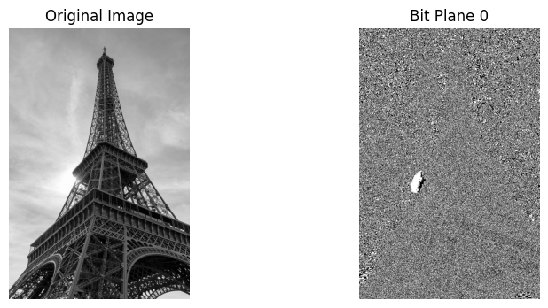
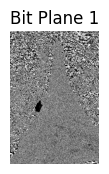
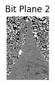

# Bit Plane Slicing in Computer Vision

## Aim

To study and understand the concept of **Bit Plane Slicing** in Computer Vision and Digital Image Processing by separating a grayscale image into different bit planes.

## Description

Bit Plane Slicing is a technique used to divide a digital image into different parts based on the **bits of each pixel**.

A grayscale image usually uses **8 bits** to represent each pixel. Therefore, the pixel value can range from **0 to 255**.

For example:

**255 = 11111111**

These 8 bits are divided into 8 bit planes:

* Bit Plane 0 – Least Significant Bit (LSB)
* Bit Plane 1
* Bit Plane 2
* Bit Plane 3
* Bit Plane 4
* Bit Plane 5
* Bit Plane 6
* Bit Plane 7 – Most Significant Bit (MSB)

Each bit plane contains either **0 or 1** for every pixel.

The lower bit planes (0, 1, 2) contain small details and sometimes noise. The higher bit planes (5, 6, 7) contain more important information about the image, such as the main shapes, objects, and brightness.

For example, if a pixel value is **170**, its binary form is:

**170 = 10101010**

Each digit belongs to a different bit plane.

By separating all the pixels in an image according to these bits, we get **8 separate binary images**. These images are called bit planes.

Bit Plane Slicing helps us understand which parts of the binary information are important for representing an image.

### Applications

Bit Plane Slicing is used in:

1. Image analysis
2. Image enhancement
3. Image compression
4. Image reconstruction
5. Noise analysis
6. Image segmentation
7. Digital watermarking
8. Steganography
9. Pattern recognition
10. Medical image processing

## Conclusion

Bit Plane Slicing is a simple and useful technique in Computer Vision and Digital Image Processing. It separates an image into different bit planes based on the binary values of its pixels.

The higher-order bit planes usually contain the main information of the image, while the lower-order bit planes contain small details and noise. By studying the different bit planes, we can understand how digital images are stored and represented.

Thus, Bit Plane Slicing helps in **image analysis, enhancement, compression, and reconstruction** and is an important basic concept in Computer Vision.
